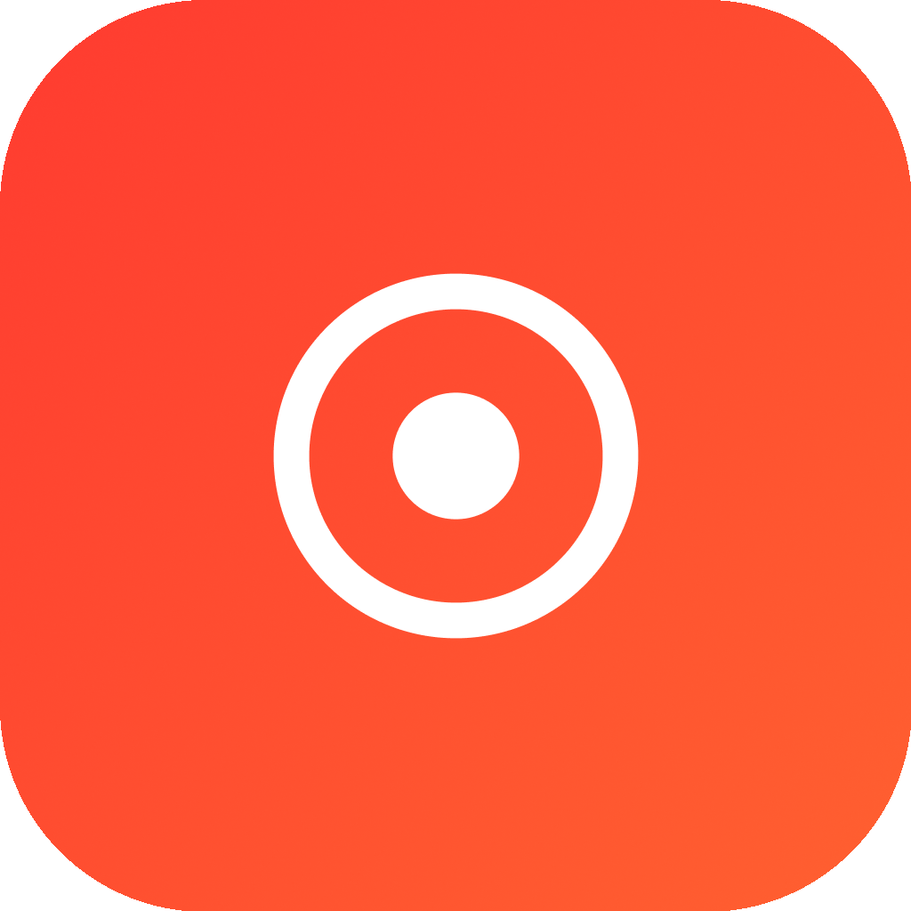

<p align="center">
  
</p>

# Kurn

[](https://github.com/carlosmazzei/Kurn/actions/workflows/swift.yml)
[](LICENSE)


Kurn is a local-first iOS and watchOS app for recording meetings,
transcribing audio, identifying speakers, and generating structured AI
summaries. It is built with Swift 6, SwiftUI, SwiftData, AVFoundation, Apple's
Speech framework, ActivityKit, and WatchConnectivity.

Recordings and meeting data are stored on device by default. Network requests
only happen when the user chooses OpenAI Whisper transcription or generates a
summary with a configured AI provider.

## Current App

- Native iPhone and iPad app targeting iOS 17.0 or newer.
- Companion Apple Watch app targeting watchOS 10.0 or newer.
- Lock Screen and Dynamic Island Live Activity for active recordings.
- Local SwiftData store for meetings, recordings, speakers, transcripts, and
  summaries.
- Local `.m4a` audio files saved in a protected subdirectory of the app's
  Documents directory, encrypted at rest with iOS Data Protection and gated
  behind Face ID / Touch ID / passcode once per session by default.
- English and Brazilian Portuguese localizations.
- App Privacy Manifest with no tracking and no collected data types.

## Features

- Create and edit meeting sessions with title, notes, and preferred language.
- Record meetings in one or more audio segments.
- Pause, resume, cancel, and stop recordings from the app.
- Control active recordings from the Lock Screen, Dynamic Island, or Apple
  Watch.
- Mirror recording state and input level to the Watch app.
- Search meetings and filter them by date range, tags, transcription status,
  summary presence, and duration.
- Organize meetings into user-defined folders, mark them favorite, or archive
  them, alongside built-in All / Inbox / Favorites / Archive views.
- Tag meetings and manage tags globally (rename, recolor, merge, delete), with
  optional LLM-based tag suggestions from the transcript.
- Save a filter as a Smart Folder that dynamically lists matching meetings.
- View folder analytics: meeting counts, durations, status breakdown, tag
  distribution, and top speakers.
- Play saved recordings and seek from transcript timestamps.
- Delete meetings and individual recording segments.
- Track local audio storage usage and reset all app data from Settings.

## Recording And Transcription

- Records AAC `.m4a` audio through an `AVAudioEngine` input tap.
- Supports whole-room and focused-speaker microphone pickup preferences.
- Supports high, standard, and low audio quality presets.
- Handles audio interruptions and route changes, including automatic pause on
  relevant route changes.
- Cleans audio before transcription with preprocessing, while falling back to
  the original file if preprocessing fails.
- Transcribes on device with Apple's Speech framework.
- Optionally transcribes with OpenAI Whisper using chunked uploads for longer
  recordings.
- Runs lightweight heuristic speaker diarization and fuses speaker turns with
  transcript spans.
- Lets users rename detected speakers.
- Resumes long transcriptions automatically after the app is backgrounded,
  terminated, or interrupted, continuing from the last completed chunk instead
  of starting over.

Supported transcription languages are auto-detect, Portuguese, English,
Spanish, French, German, Japanese, and Chinese.

## AI Summaries

Kurn can generate a structured meeting summary from existing transcripts.
Summaries include a markdown body, key decisions, and action items.

Supported summary providers:

- OpenAI
- Anthropic
- Google AI
- Groq

Each provider has selectable models in Settings. Cloud transcription always uses
OpenAI Whisper, regardless of the selected summary provider.

## Configuration

Kurn works without cloud credentials when using on-device transcription.
Cloud features require user-provided API keys.

- OpenAI key: required for Whisper transcription and OpenAI summaries.
- Anthropic key: required for Anthropic summaries.
- Google AI key: required for Gemini summaries.
- Groq key: required for Groq summaries.
- API keys are stored in the Keychain.
- Non-secret preferences are stored in `UserDefaults`.

Default preferences are managed in:

`Kurn/Infrastructure/AppSettings.swift`

Provider setup is handled through:

`Kurn/Providers/ProviderFactory.swift`

## Privacy

Kurn is designed to avoid a backend service controlled by the app.

- Audio files are saved locally in a protected subdirectory of the app's
  Documents directory (`Documents/Recordings/`) with iOS Data Protection
  (`FileProtectionType.completeUnlessOpen`), so the bytes are encrypted at
  rest using a key derived from the device passcode.
- Access to the recordings UI is gated behind Face ID / Touch ID / passcode
  once per foreground session by default; the gate can be turned off in
  Settings and the on-disk encryption stays active either way.
- Meeting metadata, transcripts, summaries, speakers, and recordings are stored
  locally with SwiftData.
- API keys are stored in the Keychain.
- Network requests are only made when the user selects a cloud transcription or
  summary feature.
- No analytics or tracking SDKs are included.
- The privacy manifest declares no tracking and no collected data types.

## Requirements

- macOS with Xcode installed.
- Xcode 16 or newer. The project has been opened with Xcode 26.5.
- iOS 17.0 or newer for the main app.
- watchOS 10.0 or newer for the Watch app.
- An iOS simulator or a physical iPhone/iPad.
- Optional: a paired Apple Watch or watchOS simulator for Watch remote control.
- Optional: API keys for OpenAI, Anthropic, Google AI, or Groq.

## Getting Started

1. Open `Kurn.xcodeproj` in Xcode.
2. Select the `Kurn` scheme.
3. Choose an iOS simulator or a connected device.
4. Press `Cmd + R` to build and run.
5. Grant microphone permission when prompted.
6. Grant speech recognition permission if you use on-device transcription.
7. Open Settings in the app to configure transcription mode, language, audio
   quality, microphone pickup, summary provider, model, and API keys.

## Running In The Simulator

In Xcode:

1. Use the device picker in the toolbar.
2. Select an iPhone simulator, such as `iPhone 17`.
3. Run the app with `Cmd + R`.

If no simulators are available, install an iOS runtime from:

`Xcode > Settings > Platforms`

For terminal builds, make sure the command line tools point to Xcode:

```bash
sudo xcode-select -s /Applications/Xcode.app/Contents/Developer
```

Then build with:

```bash
xcodebuild \
  -project Kurn.xcodeproj \
  -scheme Kurn \
  -destination 'platform=iOS Simulator,name=iPhone 17' \
  build
```

Use another simulator name if `iPhone 17` is not installed locally.

## Running Tests

Unit tests live in the `KurnTests` target and use Swift Testing. They cover
logic such as JSON parsing, Markdown export, SwiftData model helpers, audio
chunking and preprocessing, provider setup, formatting helpers, and view model
behavior against an in-memory `ModelContainer`.

Run tests from Xcode with `Cmd + U`, or from the terminal:

```bash
xcodebuild \
  -project Kurn.xcodeproj \
  -scheme Kurn \
  -destination 'platform=iOS Simulator,name=iPhone 17' \
  test
```

CI is configured in `.github/workflows/swift.yml` and runs clean test on macOS
with the `Kurn` scheme.

## Releasing

Kurn versions follow `vMAJOR.MINOR.PATCH`, tracked by `MARKETING_VERSION` /
`CURRENT_PROJECT_VERSION` in `Kurn.xcodeproj`. Cutting a release is a two-step,
Fastlane-driven process (see `fastlane/Fastfile`):

1. A maintainer runs `bundle exec fastlane bump_version type:minor` (or
   `type:patch` / `type:major`) locally. This bumps the version across all
   targets, commits, tags the commit `vX.Y.Z`, and pushes both to `main`.
2. Pushing the `vX.Y.Z` tag triggers the `release` job in
   `.github/workflows/swift.yml` (gated on tag pushes), which runs after the
   same `build-and-test` job that gates every push/PR, then publishes a
   GitHub Release with auto-generated notes.

No code signing, archiving, or App Store/TestFlight upload is automated yet —
that requires provisioning Apple Developer certificates and an App Store
Connect API key as repo secrets, which is a separate future step.

## Linting

Kurn uses SwiftLint for Swift style and static checks.

Install locally with Homebrew:

```bash
brew install swiftlint
```

Run it from the repository root:

```bash
swiftlint lint --config .swiftlint.yml
```

If SwiftLint cannot load SourceKit, make sure the active developer directory
points to Xcode:

```bash
sudo xcode-select -s /Applications/Xcode.app/Contents/Developer
```

The GitHub Actions workflow installs SwiftLint and runs linting before the
build/test step.

## Export

Meetings can be shared as structured Markdown. The export includes:

- Meeting title, date, notes, and total duration.
- Summary content, key decisions, and action items when available.
- Speaker-attributed transcript lines with timestamps.

Export generation is implemented in:

`Kurn/Infrastructure/MeetingExport.swift`

## Architecture

The app follows an MVVM-style structure with `@Observable`, `@MainActor` view
models, async service APIs, and a SwiftData model container.

```text
Kurn/
├── KurnApp.swift                 # App entry point and SwiftData container
├── ContentView.swift            # Root NavigationStack
├── Models/                      # SwiftData @Model types and shared value types
├── Views/                       # SwiftUI screens and reusable views
├── ViewModels/                  # Main-actor observable coordinators
├── Services/                    # Audio, diarization, summaries, folder analytics
│   └── Pipeline/                # Transcription pipeline stages (protocol seams)
├── Providers/                   # OpenAI, Anthropic, Google AI, and Groq clients
├── Infrastructure/              # Keychain, errors, settings, export, extensions
├── Resources/                   # Localizations and privacy manifest
└── Assets.xcassets/             # App icon and accent color

KurnWatch/
├── KurnWatchApp.swift            # Watch app entry point
├── WatchRecorderView.swift      # Watch remote control UI
└── WatchConnectivityManager.swift

KurnLiveActivityExtension/
└── RecordingLiveActivityWidget.swift
```

`Models/` includes `Meeting`, `Recording`, `Transcript`, `Speaker`, `Summary`,
`Tag`, `Folder`, and `SmartFolder`. `Infrastructure/` also hosts background
transcription scheduling and recovery
(`TranscriptionScheduler.swift`, `TranscriptionRecovery.swift`) and
`RecordingActivityAttributes.swift`, which is shared into the
`KurnLiveActivityExtension` target rather than duplicated.

## Important Implementation Notes

- Cloud transcription always uses OpenAI Whisper.
- Summary generation can use OpenAI, Anthropic, Google AI, or Groq.
- Speaker diarization is heuristic and approximate by design.
- On-device transcription availability depends on Apple's Speech framework,
  simulator/device support, and the selected language.
- Background audio recording is enabled through `UIBackgroundModes`.
- Long transcriptions resume automatically via a `BGProcessingTask` and a
  foreground recovery sweep, rather than failing when interrupted.
- The main app and extensions use checked-in `Info.plist` files.

## Development Notes

Useful files:

- `Kurn/Services/AudioRecorderService.swift`
- `Kurn/Services/TranscriptionService.swift`
- `Kurn/Services/SummaryService.swift`
- `Kurn/Services/SpeakerDiarizer.swift`
- `Kurn/Services/PhoneSessionController.swift`
- `Kurn/Views/SettingsView.swift`
- `Kurn/Infrastructure/MeetingExport.swift`

Before shipping:

- Confirm the bundle identifier and signing team.
- Test recording on a physical device.
- Test Watch remote control with a paired Apple Watch or watchOS simulator.
- Test microphone, speech recognition, Live Activity, and network permission
  flows.
- Validate export output with real meeting data.

## Acknowledgements

On-device speech recognition, speaker diarization, and voice-activity detection
are **Powered by [Fluid Inference](https://github.com/FluidInference/FluidAudio)**.
Kurn depends on the [FluidAudio](https://github.com/FluidInference/FluidAudio)
Swift package (Apache 2.0) and downloads several CoreML models on demand —
NVIDIA Parakeet TDT for ASR, pyannote / WeSpeaker / NVIDIA Sortformer for
diarization, and Silero VAD. Each carries its own license.

The full attribution list and license details are in
[THIRD_PARTY_NOTICES.md](THIRD_PARTY_NOTICES.md), and the same notices are
available in the app under **Settings → Acknowledgements**.

## License

Kurn is released under the [MIT License](LICENSE). It includes and downloads
third-party components under their own licenses; see
[THIRD_PARTY_NOTICES.md](THIRD_PARTY_NOTICES.md).
