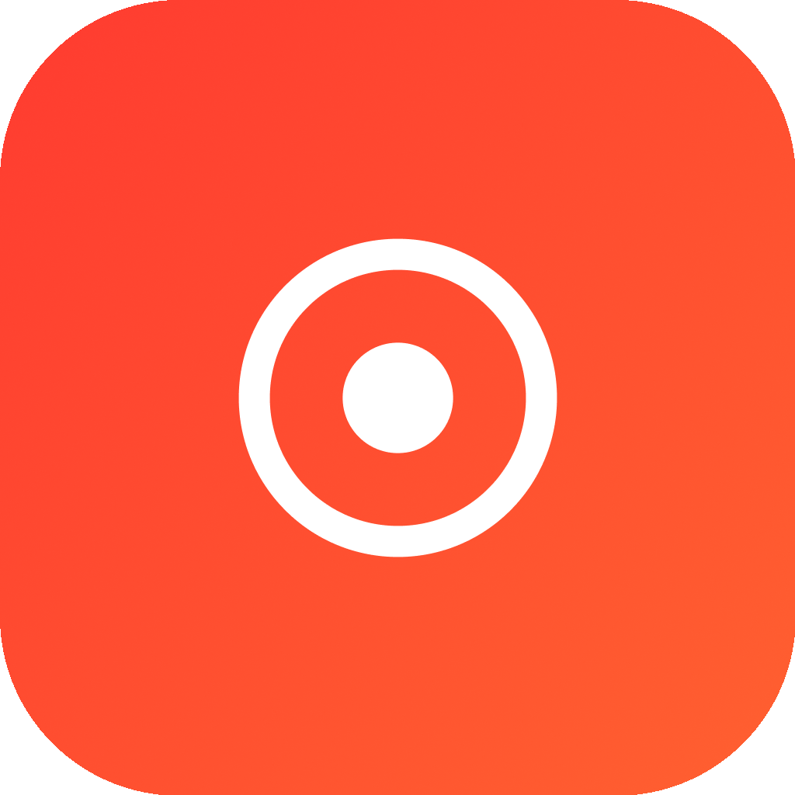

<p align="center">
  
</p>

<h1 align="center">Kurn</h1>

[](https://apps.apple.com/app/id6804278920)
[](https://github.com/carlosmazzei/Kurn/actions/workflows/swift.yml)
[](https://codecov.io/gh/carlosmazzei/Kurn)
[](LICENSE)


Kurn is a local-first iOS and watchOS app for recording meetings,
transcribing audio, identifying speakers, and generating structured AI
summaries. It is built with Swift 6, SwiftUI, SwiftData, AVFoundation, Apple's
Speech framework, ActivityKit, and WatchConnectivity.

Recordings and meeting data are stored on device by default. Network requests
only happen when the user chooses cloud (Whisper-compatible) transcription or
generates a summary with a configured AI provider.

> **Kurn is available on the App Store:**
> [apps.apple.com/app/id6804278920](https://apps.apple.com/app/id6804278920).
> You can also build it yourself from this repo (see
> [Getting Started](#getting-started)).

## Current App

- Native iPhone and iPad app targeting iOS 26.0 or newer, built around the
  system's Liquid Glass navigation chrome.
- Companion Apple Watch app targeting watchOS 10.0 or newer.
- Lock Screen and Dynamic Island Live Activity for active recordings.
- Local SwiftData store for meetings, recordings, speakers, transcripts, and
  summaries.
- Local `.m4a` audio files saved in a protected subdirectory of the app's
  Documents directory, encrypted at rest with iOS Data Protection and gated
  behind Face ID / Touch ID / passcode once per session by default.
- UI localized into 7 languages, and transcription supports every language
  Whisper does — see [Supported Languages](#supported-languages).
- App Privacy Manifest with no tracking and no collected data types.

## Features

- Create and edit meeting sessions with title, notes, and preferred language.
- Record meetings in one or more audio segments.
- Pause, resume, cancel, and stop recordings from the app.
- Control active recordings from the Lock Screen, Dynamic Island, or Apple
  Watch.
- Mirror recording state and input level to the Watch app.
- Search meetings and filter them by date range, tags, transcription status,
  summary presence, and duration.
- Organize meetings into user-defined folders, mark them favorite, or archive
  them, alongside built-in All / Inbox / Favorites / Archive views.
- Tag meetings and manage tags globally (rename, recolor, merge, delete), with
  optional LLM-based tag suggestions from the transcript.
- Save a filter as a Smart Folder that dynamically lists matching meetings.
- View folder analytics: meeting counts, durations, status breakdown, tag
  distribution, and top speakers.
- Play saved recordings and seek from transcript timestamps.
- Delete meetings and individual recording segments. Deletion moves audio into
  a protected trash folder first and only purges it once the SwiftData
  mutation has committed, so a failed save or a crash mid-delete never leaves
  a meeting pointing at missing audio.
- Start a recording hands-free from Siri and Shortcuts (`StartRecordingIntent`),
  or from a Control Center / Lock Screen / Action Button control
  (`StartRecordingControl`), without unlocking the app first.
- Chat with your meetings and search them semantically, on device: transcripts
  are embedded with Apple's `NaturalLanguage` framework and retrieval-grounded
  answers come from the selected AI provider.
- Optional, off-by-default derived artifacts: a per-meeting wiki article,
  free-form documents synthesized across meetings, and an LLM correction pass
  over the transcript with a change-magnitude guardrail.
- Recognize returning voices: when a new speaker's voiceprint closely matches
  a named speaker from another meeting, Kurn suggests the name for
  confirmation — it never renames silently.
- Track local audio storage usage, manage downloaded on-device transcription
  models, and reset all app data from Settings.
- A single **Health & Recovery** screen in Settings aggregates pending capture
  recovery, quarantined audio, degraded transcripts, failed transcription jobs,
  corrupt on-device models and recent failure codes, and dispatches the same
  repair actions the per-item screens use.
- Full VoiceOver support, Dynamic Type, and Reduce Motion throughout the app,
  the Watch companion, and the Lock Screen/Dynamic Island Live Activity — see
  [Accessibility](#accessibility).

## Recording And Transcription

- Records AAC `.m4a` audio through an `AVAudioEngine` input tap.
- Supports whole-room and focused-speaker microphone pickup preferences.
- Supports high, standard, and low audio quality presets.
- Handles audio interruptions and route changes, including automatic pause on
  relevant route changes.
- Optional live transcription preview while recording (opt-in, off by
  default) — a rolling on-device preview shown during the meeting; it never
  replaces the full transcript generated afterward.
- Cleans audio before transcription with preprocessing, while falling back to
  the original file if preprocessing fails.
- Transcribes on device with Apple's Speech framework, with FluidAudio's
  multilingual Parakeet model (which additionally auto-detects the spoken
  language), or with Whisper itself via whisper.cpp — Whisper's accuracy and
  language coverage with nothing leaving the device.
- Optionally transcribes with a cloud Whisper-compatible API using chunked
  uploads for longer recordings. The transcription provider (OpenAI, Groq, or
  a custom OpenAI-compatible endpoint) is chosen independently of the summary
  provider.
- Runs speaker diarization with a choice of three on-device engines — a
  lightweight built-in heuristic, FluidAudio's neural engine, or sherpa-onnx's
  segmentation-first engine (a collapse-resistant alternative for far-field
  audio, CPU-only) — and fuses speaker turns with transcript spans.
- Voice-activity detection and language detection are each independently
  configurable between an always-available built-in engine and a FluidAudio
  on-device model.
- FluidAudio's on-device models are downloaded only after the user opts in per
  feature in Settings, and can be listed and deleted individually to reclaim
  storage.
- Lets users rename detected speakers.
- Resumes long transcriptions automatically after the app is backgrounded,
  terminated, or interrupted, continuing from the last completed chunk instead
  of starting over.

Transcription supports auto-detect plus every language OpenAI's Whisper model
recognizes (101 options total) — see [Supported Languages](#supported-languages)
for the full list and per-engine caveats.

## Supported Languages

Kurn's UI and its transcription-language list are independent and configured
separately. The UI is localized into 7 languages (English, Brazilian
Portuguese, Spanish, French, German, Italian, Chinese), while the
transcription-language picker covers auto-detect plus every language Whisper
supports (101 options).

The full language lists, per-engine transcription support notes, and a guide
for contributing a new UI language live in
[`docs/supported-languages.md`](docs/supported-languages.md).

## Accuracy And Evaluation

Kurn's recognition accuracy is measured rather than asserted. `KurnTests/`
implements word error rate and NIST diarization error rate, and the
[pipeline evaluation workflow](.github/workflows/pipeline-eval.yml) runs the
app's real pipeline over public benchmark audio once per configuration in the
preprocessing × VAD × diarization × ASR-engine matrix, scoring each.

Latest recorded results:

| Language | Best measured configuration | WER | DER | Material |
| --- | --- | --- | --- | --- |
| Portuguese | no preprocessing + FluidAudio Parakeet | 26.58% | not measured | 80 items from CAMOES + CORAA, [2026-08-03](https://github.com/carlosmazzei/Kurn/actions/runs/30800039020) |
| English | standardDSP + FluidAudio Parakeet | 22.70% | 32.89% | AMI Meeting Corpus, 4 meetings, [2026-08-03](https://github.com/carlosmazzei/Kurn/actions/runs/30800039020) |

Two caveats travel with every number above: there is deliberately no pass/fail
threshold, and the rates are comparable between runs over the same material —
**not** against published figures for the same corpora, since the text
normalization here is language-neutral by design.

Every recorded run, the full per-configuration tables, and what the numbers do
and do not mean live in
[`docs/pipeline-evaluation.md`](docs/pipeline-evaluation.md).

## AI Summaries

Kurn can generate a structured meeting summary from existing transcripts.
Summaries are template-driven and render Markdown in section titles, body text,
and bullet items, so provider output can use emphasis, links, inline code,
headings, and ordered or unordered lists where helpful. Built-in templates
cover General, Stand-up, and Interview meetings; users can also create,
edit, and delete their own custom templates in Settings.

Long transcripts are summarized in stages. The Summary tab keeps the generation
state in place, shows progress for staged summaries, and lets the user cancel
the current run without losing an existing summary.

Supported summary providers:

- Apple Intelligence — on-device Foundation Models (`FoundationModelsProvider`),
  no API key and no network call; the default for new installs.
- OpenAI
- Anthropic
- Google AI
- Groq

All LLM-backed features (summaries, chat, tag suggestions, wiki, documents,
transcript correction) resolve through the same `ProviderFactory`, so the
selected provider applies everywhere. Each cloud provider has selectable
models in Settings. Cloud transcription uses a
Whisper-compatible API chosen independently of the summary provider, from
whichever OpenAI-compatible provider (OpenAI, Groq, or a custom endpoint) has
a configured key — Anthropic and Google AI don't expose a transcription API,
so they're only usable for summaries.

## Configuration

Kurn works without cloud credentials when using on-device transcription.
Cloud features require user-provided API keys.

- OpenAI key: required for OpenAI summaries, and usable for Whisper
  transcription.
- Anthropic key: required for Anthropic summaries.
- Google AI key: required for Gemini summaries.
- Groq key: required for Groq summaries, and usable for Whisper transcription
  (Groq serves `whisper-large-v3`).
- API keys are stored in the Keychain; saving a key is an explicit action with
  a typed success/failure outcome rather than a silent write.
- Non-secret preferences are stored in `UserDefaults`.
- Large downloads (on-device transcription and diarization models) are
  Wi-Fi-only by default and are only fetched after the user enables the
  corresponding feature in Settings; an "allow expensive network transfers"
  setting opts into cellular/constrained paths. Downloads resume, verify a checksum before staging, and replace the
  previous model only after verification.

Default preferences are managed in:

`Kurn/Infrastructure/AppSettings.swift`

Provider setup is handled through:

`Kurn/Providers/ProviderFactory.swift`

## Privacy

Kurn is designed to avoid a backend service controlled by the app.

- Audio files are saved locally in a protected subdirectory of the app's
  Documents directory (`Documents/Recordings/`) with iOS Data Protection
  (`FileProtectionType.completeUnlessOpen`), so the bytes are encrypted at
  rest using a key derived from the device passcode.
- Access to the recordings UI is gated behind Face ID / Touch ID / passcode
  once per foreground session by default; the gate can be turned off in
  Settings and the on-disk encryption stays active either way.
- Meeting metadata, transcripts, summaries, speakers, and recordings are stored
  locally with SwiftData.
- API keys are stored in the Keychain.
- Network requests are only made when the user selects a cloud transcription or
  summary feature; the default summary provider is Apple's on-device model.
- Cloud provider calls go through a hardened HTTP boundary: request timeouts,
  bounded retries, HTTPS-only URL validation with redirect limits, and a
  per-provider circuit breaker that stops retrying a failing vendor.
- Reliability diagnostics (see [Resilience](#resilience)) record only
  operation IDs and error codes — never paths, titles, audio or transcript
  text — and the exportable log is redacted the same way.
- No analytics or tracking SDKs are included.
- The privacy manifest declares no tracking and no collected data types.

## Accessibility

- Full VoiceOver support across the iOS app, the Watch companion
  (`KurnWatch`), and the Lock Screen/Dynamic Island Live Activity
  (`KurnLiveActivityExtension`) — every interactive control has a label, and
  decorative-only elements (waveforms, status dots already redundant with
  text) are hidden from the accessibility tree instead of read aloud.
- Dynamic Type: reading text scales with the user's preferred text size via
  semantic, Dynamic-Type-aware fonts. A few fixed-geometry elements (e.g. the
  Recorder's timer) scale up to a capped size via `@ScaledMetric` rather than
  unbounded, to avoid breaking a fixed-dimension layout.
- Reduce Motion is respected: looping animations render their final static
  state instead of animating when the setting is on.
- Status is never conveyed by color alone — e.g. the Live Activity's
  recording/paused indicator differs by icon shape, not just color.
- The Watch and Live Activity targets are localized into the same 7 languages
  as the main app, not just English/Portuguese, so VoiceOver reads the right
  language everywhere.
- Enforced by a SwiftLint guardrail (`accessibility_label_for_image`,
  `accessibility_trait_for_button`, both build-breaking) and an automated UI
  test (`KurnUITests/AccessibilityAuditUITests.swift`) that runs
  `XCUIApplication.performAccessibilityAudit(for:)` over key screens in CI.
- App Store Accessibility Nutrition Labels are declared in
  `fastlane/accessibility.json`: VoiceOver, Larger Text, Reduced Motion, and
  Differentiate Without Color Alone for iPhone, iPad, and Apple Watch.

## Requirements

- macOS with Xcode installed.
- Xcode 26 or newer (the iOS 26 SDK is required). The project has been opened
  with Xcode 26.5.
- iOS 26.0 or newer for the main app.
- watchOS 10.0 or newer for the Watch app.
- An iOS simulator or a physical iPhone/iPad.
- Optional: a paired Apple Watch or watchOS simulator for Watch remote control.
- Optional: API keys for OpenAI, Anthropic, Google AI, or Groq.

## Getting Started

1. Open `Kurn.xcodeproj` in Xcode.
2. Select the `Kurn` scheme.
3. Choose an iOS simulator or a connected device.
4. Press `Cmd + R` to build and run.
5. Grant microphone permission when prompted.
6. Grant speech recognition permission if you use on-device transcription.
7. Open Settings in the app to configure transcription mode, language, audio
   quality, microphone pickup, summary provider, model, and API keys.

## Running In The Simulator

In Xcode:

1. Use the device picker in the toolbar.
2. Select an iPhone simulator, such as `iPhone 17`.
3. Run the app with `Cmd + R`.

If no simulators are available, install an iOS runtime from:

`Xcode > Settings > Platforms`

For terminal builds, make sure the command line tools point to Xcode:

```bash
sudo xcode-select -s /Applications/Xcode.app/Contents/Developer
```

Then build with:

```bash
xcodebuild \
  -project Kurn.xcodeproj \
  -scheme Kurn \
  -destination 'platform=iOS Simulator,name=iPhone 17' \
  build
```

Use another simulator name if `iPhone 17` is not installed locally.

## Running Tests

Tests use Swift Testing and are split across four targets:

- `KurnTests` — unit tests for JSON parsing, Markdown export, SwiftData model
  helpers, audio chunking and preprocessing, provider setup, formatting
  helpers, the recording journal, the resource scheduler, and view model
  behavior against an in-memory `ModelContainer`.
- `KurnSwiftDataTests` — store boot, backup/salvage and other
  concurrency-sensitive SwiftData suites, isolated in their own process.
- `KurnUITests` — the accessibility audit (and the fastlane screenshot suite,
  which only runs via `fastlane screenshots`).
- `Packages/KurnCore/Tests` — the pure-Foundation package, runnable without
  Xcode: `(cd Packages/KurnCore && swift test)`.

Run tests from Xcode with `Cmd + U`, or from the terminal:

```bash
xcodebuild \
  -project Kurn.xcodeproj \
  -scheme Kurn \
  -destination 'platform=iOS Simulator,name=iPhone 17' \
  test
```

CI is configured in `.github/workflows/swift.yml` (`iOS CI`) and runs on every
push to `main` and every pull request targeting it, as five independent jobs:
`lint-and-validate` (SwiftLint, localization and store-metadata checks),
`static-policy` (`python3 Tools/check_static_policy.py` — bans unchecked
`save()`, `fatalError`, ad-hoc `URLSession`s and raw error text in public
logs, against an allow-list baseline that fails when it goes stale),
`unit-tests` (`KurnTests` + `KurnSwiftDataTests` on a macOS simulator),
`ui-accessibility-tests` (`KurnUITests`) and `kurncore-linux` (`swift test`
for `Packages/KurnCore` on Ubuntu).

### Coverage

The three test jobs export lcov reports (`xcrun llvm-cov export` from the
Xcode profile data, `llvm-cov export` from SwiftPM's on Linux) and upload
them to [Codecov](https://codecov.io/gh/carlosmazzei/Kurn) under the
`unittests`, `uitests` and `kurncore` flags, which is what the badge at the
top of this file reports. Third-party SwiftPM checkouts and test sources are
excluded so the number describes first-party production code. Coverage is
informational only (`codecov.yml` marks every status `informational: true`):
it is visible on every PR but never blocks a merge, since no coverage
threshold with a real baseline has been established.

### Reliability hardening lane

`.github/workflows/reliability-hardening.yml` runs weekly and on demand
rather than on every PR. It re-runs the concurrency-sensitive suites
(capture ownership, sink faults, the recording journal, the circuit breaker,
the reliability-event store, model downloads, the SwiftData store boot) under
Thread Sanitizer, runs the unit-test selection in the Release configuration,
and measures the UI-test flake rate over five attempts, reporting a
`passed/total` count without a pass/fail threshold.

A second workflow, `.github/workflows/pipeline-eval.yml`, is a measurement run
rather than a merge gate: it is dispatched on demand to score the recognition
pipeline against public benchmark corpora. See
[Accuracy And Evaluation](#accuracy-and-evaluation).

## Releasing

Kurn versions follow `vMAJOR.MINOR.PATCH`, tracked by `MARKETING_VERSION` /
`CURRENT_PROJECT_VERSION` in `Kurn.xcodeproj`. Cutting a release is a two-step,
Fastlane-driven process (see `fastlane/Fastfile`):

1. A maintainer runs `bundle exec fastlane bump_version type:minor` (or
   `type:patch` / `type:major`) locally. This bumps the version across all
   targets, commits, tags the commit `vX.Y.Z`, and pushes both to `main`.
2. Pushing the `vX.Y.Z` tag triggers the `release` job in
   `.github/workflows/swift.yml` (gated on tag pushes), which runs once the
   same five CI jobs that gate every push/PR pass, then publishes a
   GitHub Release with auto-generated notes.

Pushing the tag also starts the protected App Store pipeline. After the CI
jobs, `beta` signs with `fastlane match`, uploads to TestFlight, and waits for
Apple to finish processing; in parallel, the reusable screenshots workflow
captures iPhone, iPad, and Watch assets and chains the marketing-screenshot
renderer (`marketing-screenshots.yml`, real device frames) onto them, then
`store_assets` reconciles the remote screenshot set (removing stale/duplicate images), uploads all assets
to the exact tagged app version, and synchronizes draft Accessibility Nutrition
Labels. Once both branches succeed, `submit` derives the exact version/build
from the tagged project and offers it to App Review.
TestFlight upload, assets upload, and submission each wait for administrator
approval through the `release` GitHub Environment. After the first version is
live, the protected `App Store Accessibility` workflow can publish the synced
labels (Apple doesn't permit publishing them before a live version exists).
Account-level setup and the public release after Apple's approval remain manual
— see
[`docs/app-store-submission-checklist.md`](docs/app-store-submission-checklist.md)
for the full breakdown.

## Linting

Kurn uses SwiftLint for Swift style and static checks.

Install locally with Homebrew:

```bash
brew install swiftlint
```

Run it from the repository root:

```bash
swiftlint lint --config .swiftlint.yml
```

If SwiftLint cannot load SourceKit, make sure the active developer directory
points to Xcode:

```bash
sudo xcode-select -s /Applications/Xcode.app/Contents/Developer
```

The GitHub Actions workflow installs SwiftLint and runs linting before the
build/test step. Shared CI steps (SwiftPM cache, simulator preparation, failure
diagnostics, coverage upload) live as composite actions under
`.github/actions/`, and Dependabot keeps GitHub Actions, SwiftPM, Bundler and
the other package manifests in the repo up to date.

## Export

Meetings can be shared as structured Markdown in two formats — **Standard**,
and **Obsidian** (YAML frontmatter plus `[[wikilinks]]` for speakers, ready to
drop into a vault). The export includes:

- Meeting title, date, notes, and total duration.
- Summary content, key decisions, and action items when available.
- Speaker-attributed transcript lines with timestamps.

Export generation is implemented in:

`Kurn/Infrastructure/MeetingExport.swift`

## Architecture

The app follows an MVVM-style structure with `@Observable`, `@MainActor` view
models, async service APIs, and a SwiftData model container.

```text
Kurn/
├── KurnApp.swift                 # App entry point and SwiftData container
├── ContentView.swift            # Root NavigationStack
├── Models/                      # SwiftData @Model types and shared value types
├── Views/                       # SwiftUI screens and reusable views
├── ViewModels/                  # Main-actor observable coordinators
├── Services/                    # Audio, diarization, live preview, summaries, folder analytics
│   └── Pipeline/                # Transcription pipeline stages (protocol seams,
│                                 # each with a built-in and a FluidAudio engine)
├── Providers/                   # Apple Foundation Models, OpenAI, Anthropic, Google AI
│                                 # and Groq clients behind one LLMProvider seam
├── AppIntents/                  # Siri / Shortcuts start-recording intent
├── Infrastructure/              # Keychain, settings, export, store boot, journal,
│                                 # recovery, reliability events, resource scheduler
├── DebugSupport/                # Debug-only fault injection hooks
├── Resources/                   # Localizations and privacy manifest
└── Assets.xcassets/             # App icon and accent color

Packages/
├── KurnCore/                    # Pure-Foundation logic (AppError, ReliabilityEvent,
│                                 # filesystem/clock seams); `swift test` on Linux
└── WhisperCpp/                  # Binary target wrapping whisper.cpp's XCFramework

KurnWatch/
├── KurnWatchApp.swift            # Watch app entry point
├── WatchRecorderView.swift      # Watch remote control UI
└── WatchConnectivityManager.swift

KurnLiveActivityExtension/
└── RecordingLiveActivityWidget.swift
```

`Models/` includes `Meeting`, `Recording`, `Transcript`, `Speaker`, `Summary`,
`Tag`, `Folder`, `SmartFolder`, `SummaryTemplate`, `SummarySection`, and
`FolderCatalog`. `Infrastructure/` also hosts background transcription
scheduling and recovery (`TranscriptionScheduler.swift`,
`TranscriptionRecovery.swift`, `BackgroundActivity.swift`), disk/memory
guardrails and on-device model downloads (`ResourceGuard.swift`,
`ModelDownloadConsent.swift`), and `RecordingActivityAttributes.swift`, which
is shared into the `KurnLiveActivityExtension` target rather than duplicated.

### Resilience

Kurn is local-first, so a recording is usually the only copy of the audio.
The resilience track in [`docs/roadmap.md`](docs/roadmap.md) (H1–H10) turns
that into concrete rules the code follows:

- **Capture never loses audio silently.** `AudioRecorderService` writes
  through an `AudioSinkWriting` seam; a sink failure or stall stops the
  recording, marks it for recovery, and emits a reliability event.
- **The store boots or asks for help.** `ModelStoreBootCoordinator` takes a
  pre-open backup and, if Application Support cannot be resolved or the
  store cannot open, enters an explicit recovery screen instead of silently
  falling back to a temporary directory. Restore/salvage/fresh-start actions
  are only offered when a durable directory exists.
- **File operations are journaled.** `RecordingOperationJournal` records
  intent → trashed → committed for every destructive file operation and
  replays it on launch; records it cannot read are quarantined under
  `Journal/Unreadable` rather than dropped.
- **Versioned JSON is validated.** `JSONStorage` distinguishes corruption from
  an envelope written by a newer app version and preserves the original bytes
  in both cases.
- **Network and models have limits.** `ProviderCircuitBreaker` opens after
  repeated provider failures; `ModelFileDownloader` verifies each download
  (size plus the integrity hash the origin publishes for that transfer) and
  installs atomically, so a failed download never replaces a working model.
- **Concurrency has one owner.** Heavy work is admitted through
  `withResourceReservation` on `ResourceScheduler`, which releases the
  reservation on success, error and cancellation alike.
- **Failures are observable and redacted.** `ReliabilityEvent`s carry an
  operation, stage, outcome and code — never paths, titles, audio or raw error
  text — into a bounded on-device store surfaced in Settings → Health &
  Recovery. Public `os.Logger` lines use `Error.publicLogCode`; the static
  policy check enforces this in CI.

## Important Implementation Notes

- Cloud transcription uses a Whisper-compatible API (OpenAI or Groq today),
  chosen independently of the summary provider.
- Summary generation can use OpenAI, Anthropic, Google AI, or Groq, and long
  transcripts use a staged map-reduce pass with progress and cancellation in
  the Summary tab.
- Voice-activity detection, transcription, and language detection are each
  independently configurable between a built-in engine (available offline, no
  download) and a FluidAudio on-device engine. Speaker diarization has a third
  option too: sherpa-onnx's segmentation-first engine, offered alongside
  FluidAudio's neural engine as a collapse-resistant alternative for far-field
  audio (CPU-only, no Apple Neural Engine acceleration). The built-in diarizer
  is heuristic and approximate by design; both neural engines require a
  one-time, opt-in download.
- On-device transcription availability depends on Apple's Speech framework
  or the downloaded FluidAudio model, simulator/device support, and the
  selected language.
- Background audio recording is enabled through `UIBackgroundModes`.
- Long transcriptions resume automatically via a `BGProcessingTask` and a
  foreground recovery sweep, rather than failing when interrupted.
- The main app and extensions use checked-in `Info.plist` files.

## Development Notes

Useful files:

- `Kurn/Services/AudioRecorderService.swift`
- `Kurn/Services/TranscriptionService.swift`
- `Kurn/Services/LiveTranscriptionService.swift`
- `Kurn/Services/SummaryService.swift`
- `Kurn/Services/SpeakerDiarizer.swift`
- `Kurn/Services/PhoneSessionController.swift`
- `Kurn/Infrastructure/ModelDownloadConsent.swift`
- `Kurn/Views/SettingsView.swift`
- `Kurn/Infrastructure/MeetingExport.swift`

Before shipping:

- Confirm the bundle identifier and signing team.
- Test recording on a physical device.
- Test Watch remote control with a paired Apple Watch or watchOS simulator.
- Test microphone, speech recognition, Live Activity, and network permission
  flows.
- Validate export output with real meeting data.

## Acknowledgements

On-device speech recognition, speaker diarization, and voice-activity detection
are **Powered by [Fluid Inference](https://github.com/FluidInference/FluidAudio)**.
Kurn depends on the [FluidAudio](https://github.com/FluidInference/FluidAudio)
Swift package (Apache 2.0) and downloads several CoreML models on demand —
NVIDIA Parakeet TDT for ASR, pyannote / WeSpeaker / NVIDIA Sortformer for
diarization, and Silero VAD. Each carries its own license.

The optional third diarization engine depends on
[sherpa-onnx](https://github.com/k2-fsa/sherpa-onnx) (Apache 2.0) and
downloads pyannote's segmentation-3.0 model (MIT) and a 3D-Speaker CAM++
speaker-embedding model (Apache 2.0), both converted to ONNX by the
sherpa-onnx project.

The full attribution list and license details are in
[THIRD_PARTY_NOTICES.md](THIRD_PARTY_NOTICES.md), and the same notices are
available in the app under **Settings → Acknowledgements**.

## License

Kurn is released under the [MIT License](LICENSE). It includes and downloads
third-party components under their own licenses; see
[THIRD_PARTY_NOTICES.md](THIRD_PARTY_NOTICES.md).

## Privacy

Kurn's data handling is described in [PRIVACY.md](PRIVACY.md).

## Encryption

Kurn's use of encryption, for App Store export compliance, is described in
[ENCRYPTION.md](ENCRYPTION.md).

## Terms of Use

Using Kurn — including your responsibility for consent when recording other
people — is described in [TERMS.md](TERMS.md). [EULA.md](EULA.md) is the same
substantive terms formatted to satisfy Apple's required minimum terms, ready
to paste into App Store Connect as a custom License Agreement if the default
Apple Standard License Agreement isn't used.
