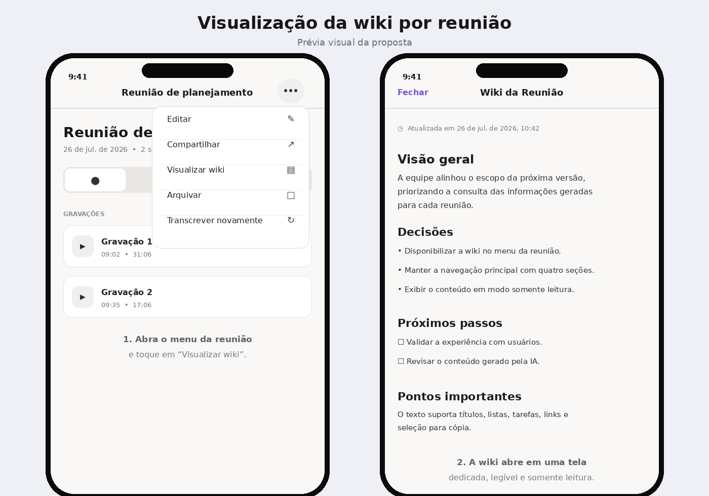

# Prévia: wiki por reunião

A proposta mantém as quatro áreas principais da reunião e coloca **Visualizar wiki** no menu de ações, somente quando já existe um artigo gerado. Assim, a wiki permanece acessível sem reduzir o espaço do seletor segmentado.

> Esta imagem é uma prévia estática para comunicar o fluxo. A aparência final segue os componentes SwiftUI, o tema e as configurações de acessibilidade do dispositivo.
